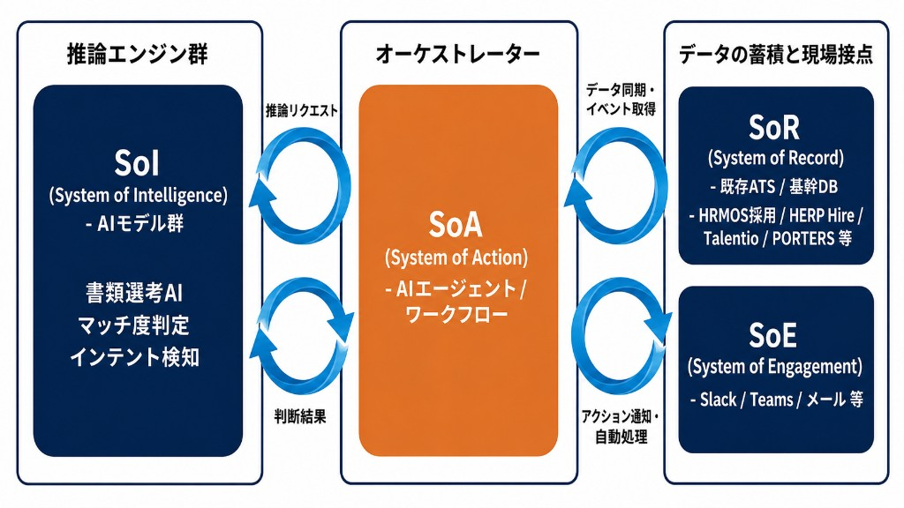

# Laravel 簡易ATS + Laravel MCP（LT デモ）

**目的**: AI に DB を直接触らせず、**許可された MCP Tool** が **Laravel の Service 層**を通じて採用データを参照するデモ。5 分 LT 向け（本番品質ではありません）。

## アーキテクチャ上の位置づけ（SoR）

採用 AI の全体図（SoR / SoE / SoA / SoI）で見たとき、**本リポジトリの Laravel アプリは SoR（System of Record）に相当**します。



*図: SoI（書類選考 AI・マッチ度判定・インテント検知など）と SoA（AI エージェント／ワークフロー）が推論リクエスト／判断結果で往復し、SoA が SoR からデータ同期・イベント取得、SoE へアクション通知・自動処理するイメージ。**本リポジトリは図中の SoR（既存 ATS／基幹 DB）に相当**します。*

| レイヤ | 役割（概要） | 本リポジトリとの関係 |
|--------|----------------|----------------------|
| **SoR** | 候補者・求人・選考など採用データの**正本**（既存 ATS の例: Porters 等） | **ここ**。SQLite の業務テーブルと Blade の `/ats` がそのミニチュア版。 |
| **SoE** | 現場接点・コミュニケーション（Slack / Teams 等） | 未実装。将来の通知先のイメージ。 |
| **SoA** | オーケストレーター（AI エージェント）。SoR/SoE の監視、推論依頼、通知・書き戻し | **本アプリではない**。Claude Code 等の MCP ホストや外部エージェントが SoA 側として **この SoR に MCP で接続**する想定。 |
| **SoI** | 推論エンジン（書類選考 AI、インテント検知等） | **本アプリではない**。別システムが判断結果を SoA に返すイメージ。 |

MCP は「SoA から SoR の正規の窓口を渡す」ための接続例としてデモしています（DB 直操作はさせず、Tool → Service に限定）。

## 技術スタック

- Laravel 12 / PHP 8.2+
- SQLite
- Blade（管理画面）
- [laravel/mcp](https://github.com/laravel/mcp)（`composer.json` で `^0.7`）

**注意**: Laravel のキュー用テーブル名 `jobs` と衝突しないよう、求人は **`job_postings` テーブル**＋ Eloquent `App\Models\Job`（`$table = 'job_postings'`）です。

## セットアップ

```bash
cd /path/to/laravel-mcp-sample
composer install
cp .env.example .env
php artisan key:generate
touch database/database.sqlite   # まだ無い場合
php artisan migrate --seed
```

開発サーバー:

```bash
php artisan serve
```

## 画面 URL

| URL | 内容 |
|-----|------|
| http://localhost:8000/ats | ダッシュボード |
| http://localhost:8000/ats/candidates | 候補者一覧 |
| http://localhost:8000/ats/jobs | 求人一覧 |
| http://localhost:8000/ats/pipeline | 求人別パイプライン集計 |

## MCP サーバー（ローカル STDIO）

`routes/ai.php` で次のように登録済みです。

- ハンドル名: **`ats-demo`**
- サーバークラス: `App\Mcp\Servers\AtsMcpServer`

起動:

```bash
php artisan mcp:start ats-demo
```

パッケージのコマンド一覧は `php artisan list | grep mcp` で確認してください（バージョン差異あり）。

## Claude Code からの接続

プロジェクトルートの [`.mcp.json.example`](.mcp.json.example) を **`.mcp.json`** にコピーし、必要なら `cwd` を環境に合わせて調整します。Claude Code を再起動して MCP を読み込ませてください。

## 利用できる MCP Tools

| Tool | 説明 |
|------|------|
| `search_candidates` | skill / status / position で候補者検索（最大 10 件、email なし） |
| `get_pipeline_summary` | 求人別・ステージ別件数（`job_id` 省略で全求人） |
| `draft_scout_message` | スカウト文テンプレの下書き（**送信なし**） |

各 Tool 実行は `mcp_audit_logs` に記録されます（`executed_by` は未認証時 `demo-user`）。

## デモ用プロンプト例

1. Laravel 経験がある候補者を探して  
2. バックエンドエンジニア職の選考進捗を集計して  
3. 候補者 ID 1 にバックエンドエンジニア求人のスカウト文下書きを作って  
4. screening ステータスの候補者を最大 10 件で出して  
5. AI に DB を直接触らせない設計になっている箇所を説明して  

## セキュリティ上の設計意図

- MCP から **Eloquent / SQL を直接実行しない**。Tool → **Service** → Model の一方向。
- **Read 中心**のデモ: 実送信・汎用更新・削除は実装していない。
- 候補者レスポンスは **email を含めない**、検索は **最大 10 件**。
- Tool 実行は **監査ログ**に残す（本番では認証・認可・レート制限・PII マスキング等が必要）。

## テスト

```bash
php artisan test
```

Service の Unit テスト（検索・件数・パイプライン・下書き・存在しない ID）を含みます。

## 仕様書

[docs/SECURE_AI_RECRUITMENT_ATS_SPECIFICATION.md](docs/SECURE_AI_RECRUITMENT_ATS_SPECIFICATION.md)

## 今後の拡張（README に記載）

- スカウト送信前の承認フロー  
- メール送信連携  
- ATS 外部 API 連携  
- 認証ユーザーごとの Tool 権限制御  
- PII マスキング  
- レート制限  
- MCP Resources / Prompts の追加  
- 本番運用向けの監査ログ強化  
# laravel-mcp-sample
# laravel-mcp-sample
# laravel-mcp-sample
# laravel-mcp-sample
# laravel-mcp-sample
