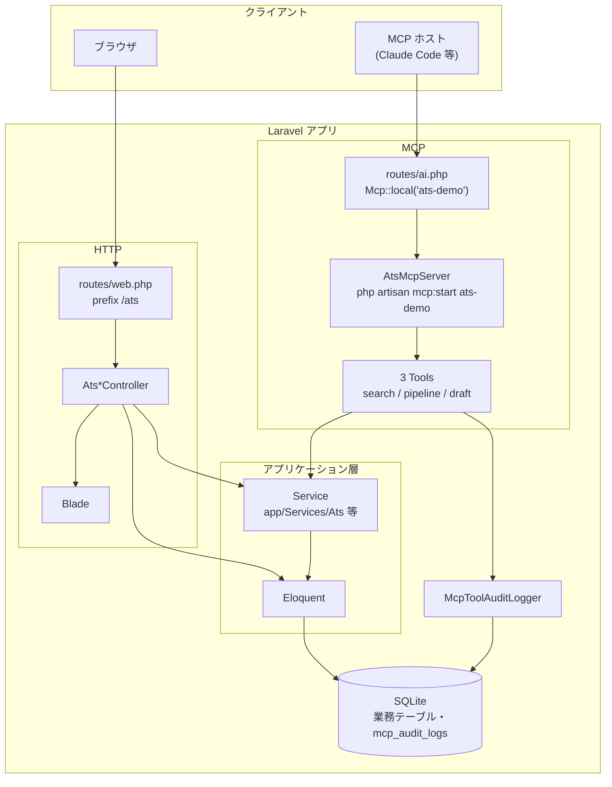
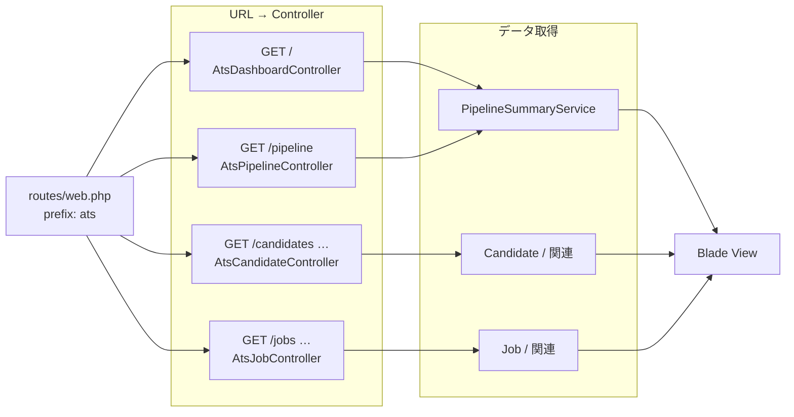
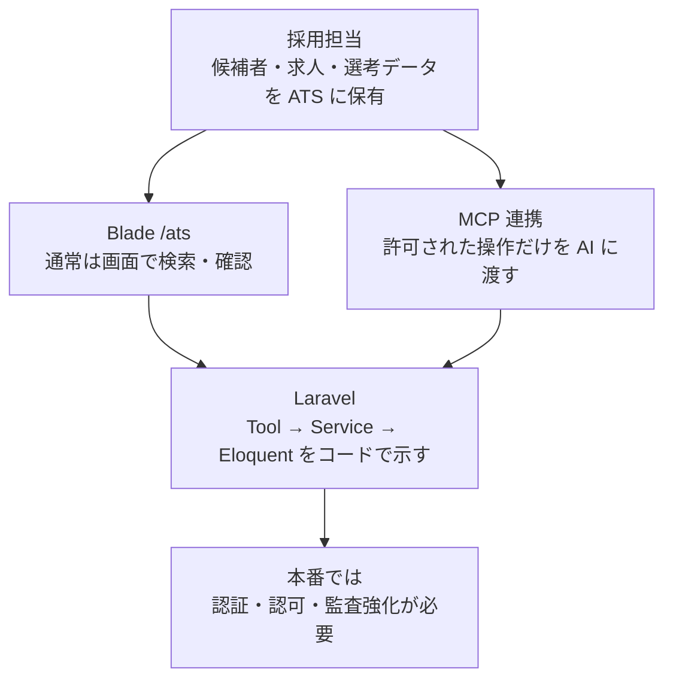
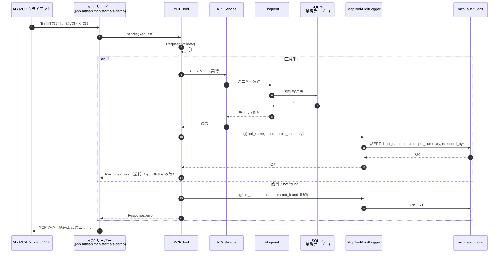

# 仕様書: Secure AI Recruitment（Laravel 簡易ATS + MCP LT）

| 項目 | 内容 |
|------|------|
| 版 | 0.5 |
| ステータス | LT デモ |

詳細な要件・脅威モデルはリポジトリの README とコード（`app/Services/Ats`、`app/Mcp`）を参照してください。

## 要点

- **Tool → Service → Eloquent**。AI に DB 直操作をさせない。
- MCP Tool: `search_candidates`, `get_pipeline_summary`, `draft_scout_message`（Read / 下書きのみ）。
- 求人 DB テーブルは **`job_postings`**（Laravel キューの `jobs` と区別）。
- 監査: `mcp_audit_logs`。

## 外部アーキテクチャとの対応（SoR）

採用領域の参照アーキテクチャでは、レイヤを次のように分ける説明がよく用いられる。**本仕様の対象システム（Laravel 簡易 ATS + MCP サーバー）は SoR に位置づける。**

| 記号 | 名称 | 役割 | 本リポジトリ |
|------|------|------|----------------|
| SoR | System of Record | 採用マスタ・選考状態など**データの正本**（商用 ATS の例: Porters 等） | **該当**。候補者・求人・パイプラインを保持し、HTTP と MCP の両方から参照される。 |
| SoE | System of Engagement | 現場との接点（Slack、Microsoft Teams 等） | 対象外（デモでは未実装）。 |
| SoA | System of Action | AI エージェント／オーケストレーター。SoR/SoE の監視、SoI への推論依頼、通知・書き戻し | 対象外。MCP クライアント（Claude Code 等）は SoA **側**から本 SoR に接続する想定。 |
| SoI | System of Intelligence | 書類選考 AI、インテント検知など**推論** | 対象外。判断結果は SoA 経由で SoR に反映される流れを別システムが担うイメージ。 |

**境界の含意**: MCP Tool は SoA が SoR を操作する際の**許可された API 面**のサンプルである。推論ロジック（SoI）やチャット UI（SoE）は本コードベースに含めない。脅威モデル・権限設計を議論するときは「正本は SoR、接続は SoA 経由で制御」と整理する。

## 処理フロー（図）

### システム全体（HTTP と MCP）

ブラウザ経由の Blade と、MCP 経由の Tool は **別入り口**。MCP 側は **Tool → Service → Eloquent** に統一し、Tool から業務 DB へ直 SQL / 無制限 ORM はさせない（要点参照）。監査ログは MCP Tool 実行時のみ `McpToolAuditLogger` が書き込む。

### Web（Blade）のリクエストフロー

ダッシュボード・パイプラインは **`PipelineSummaryService`** を利用（MCP の `get_pipeline_summary` と同じ Service）。候補者・求人の一覧・詳細はデモ簡略のため **コントローラーから Eloquent を直接**参照している（本番では Service 経由に寄せる想定）。

### LT デモの流れ（目安）

### MCP Tool 実行（シーケンス）

実装（`app/Mcp/Tools/*`、`app/Services/Ats/*`、`McpToolAuditLogger`）に沿った典型的な呼び出し。各 Tool が呼ぶ Service は次のとおり。

| Tool | Service |
|------|---------|
| `search_candidates` | `CandidateSearchService` |
| `get_pipeline_summary` | `PipelineSummaryService` |
| `draft_scout_message` | `ScoutDraftService` |

監査は **MCP Tool のみ** が `McpToolAuditLogger` 経由で `mcp_audit_logs` に書き込む。AI が業務 DB に直接 SQL を発行する経路はない。

## 改訂

| 版 | 内容 |
|----|------|
| 0.5 | システム全体図（HTTP+MCP）・Web 経路図を追記。MCP 単体図・Tool/Service 境界図は統合のため削除 |
| 0.4 | シーケンス図（Mermaid）・Tool/Service 対応表を追記 |
| 0.3 | 処理フロー図（Mermaid）を追記 |
| 0.2 | 実装反映（job_postings、MCP 3 Tool） |
